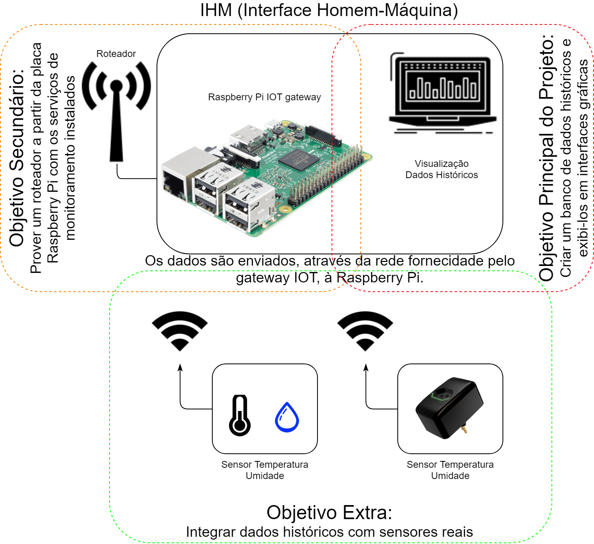
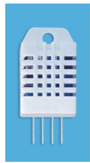
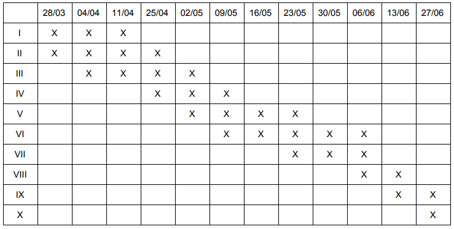

# Avaliação e Implementação de Sistema de Monitoramento de Dados de Sensores

## Internet Das Coisas: Fundamentos e Oficina - IE309X

* Daiane Alves - RA 230320  
* Rafael Rocha Heymann - RA 153763  
* Tiago Medicci Serrano - RA 094519
---
## Introdução
Ao falarmos sobre dispositivos que compõem o que conhecemos como Internet das Coisas (Internet of Things, IoT), é importante notar que a fronteira final para os dados aquisitados é, justamente, o usuário. Desta forma, a exibição e acompanhamento dos dados gerados pelos sensores deve ser apresentada de forma rápida e intuitiva ao usuário por meio de uma Interface Homem-Máquina (IHM). 
A IHM, preferencialmente exibida em uma interface gráfica, deve possibilitar análises temporais dos dados de sensores, tais como: temperatura, umidade, pressão atmosférica, consumo energético, entre outros. E ainda notificar situações críticas, sejam estas relativas aos dados dos sensores ou relativas a erros e mau funcionamento do sistema. 
Este projeto concentra-se no estudo das opções para criar uma IHM para dados aquisitados por sensores em um sistema IoT. Considerando os aspectos fundamentais na concepção de um projeto IoT, tem-se, de um lado, a coisa e, de outro, o negócio. A coisa, nesse projeto, será a avaliação de consumo energético e o monitoramento de temperatura e umidade (relacionados ao conforto térmico de um usuário) de uma sala climatizada, enquanto que o negócio visa a economia de recursos energéticos na troca de ares-condicionados por trocadores de calor adiabáticos, presumivelmente mais econômicos. 

## Objetivos
O objetivo deste projeto é concentrar os esforços na avaliação e implementação de soluções open-source para exibição e monitoramento de dados gerados por sensores IoT. 

### Avaliação de IHM para o Projeto eFEEC
O motivador principal para esta proposta é o projeto piloto eFEEC, em desenvolvimento na FEEC/Unicamp, que consiste de um projeto de eficiência energética que monitora o consumo energético e o conforto do usuário (medido por meio de sensores de temperatura e umidade) durante a utilização de ares-condicionados e trocadores de calor adiabáticos em salas de professores da FEEC. 
O sistema implementado no projeto eFEEC contém sensores de consumo energético, de temperatura e de umidade que enviam os dados de medição para um gateway concentrador através de uma conexão Wi-Fi particular e exclusiva, do projeto eFEEC. Entre os desafios do projeto eFEEC está o desenvolvimento de um gateway concentrador de dados de baixo custo. 
Alocado no gateway, os dados dos sensores devem ser exibidos ao usuário. É possível cogitar, para esta aplicação, a utilização do mini-computador Raspberry Pi. Tendo em vista a interface gráfica deste dispositivo, é formulada a hipótese de que o gateway concentrador também possa atuar como uma IHM, uma vez que o mesmo possui conexão HDMI, para ligação de um monitor de vídeo. 
A IHM representa, por si só, um desafio para o desenvolvimento do projeto eFEEC. Considerando as múltiplas funções do dispositivo Raspberry Pi ⏤ de roteador que provê a rede Wi-Fi para os sensores, de gateway IoT que requisita os dados gerados pelos sensores, de banco de dados de medição e, finalmente, de interface de monitoramento ⏤ é importante avaliar o desempenho deste dispositivo ao executar tais funcionalidades. Dessa forma, para entregar valor ao avaliar soluções de monitoramento, os objetivos serão divididos em um objetivo principal, um secundário e um extra. Os objetivos secundário e extra serão executados de acordo com os resultados obtidos pelo primeiro objetivo, respeitados os recursos humanos para tal. O diagrama da Figura 1 exemplifica a proposta deste projeto e os objetivos em ordem de prioridade.

    Figura 1 - Diagrama com os objetivos do projeto divididos em ordem de prioridade

## Metodologia

A metodologia proposta para o desenvolvimento do projeto de avaliação de um sistema de monitoramento que compõem a IHM do projeto eFEEC pode ser traçada de acordo com os três objetivos exemplificados na Figura 1, e, descritos nesta seção. 

### **Objetivo Principal**
Para o objetivo principal serão avaliadas soluções open-source que provém soluções para monitoramento de dados históricos. Para tal, é necessário que estas soluções incluem: 
a requisição de dados de sensores, evidenciando as interfaces de entrada de dados; 
o armazenamento destes dados em um banco de dados local; e 
a interface gráfica que provê, de fato, a interface com o usuário. 
Pode-se citar como exemplo de soluções, as seguintes ferramentas: Zabbix, Grafana, Graphite e Prometheus. Esta etapa avaliativa contém o caráter experimental, uma vez que o sistema deve ser avaliado em sistemas computacionais GNU/Linux.
Além disso, será avaliada a possibilidade de implementação de tais soluções, no hardware Raspberry Pi que pode ser utilizado para constituir a IHM do projeto eFEEC, dando sequência ao objetivo secundário.

### Objetivo Secundário
A depender dos resultados obtidos sobre as soluções de monitoramento, o objetivo secundário é constituir um gateway IoT com o dispositivo Raspberry Pi. Para tal, é necessário que este atue como um roteador, provendo a rede Wi-Fi para que os sensores sejam conectados, bem como prover o acesso à interface gráfica de monitoramento através de um servidor web.
### Objetivo Extra
---
Após o término da experimentação tecnológica e desenvolvimento do gateway concentrador, o objetivo extra consiste em aquisitar os dados reais dos sensores de consumo energético e de temperatura e umidade instalados durante a implementação do projeto eFEEC. A princípio, o objetivo primordial é receber dados que emulam estes sensores e, baseado nestes resultados, será avaliada a disponibilidade para atuar na recepção dos dados reais.
Cabe, por fim, citar que os sensores utilizados neste projeto descrito nas seções seguintes, possuem circuitos  individuais de condicionamento de sinais, para os dados gerados. Assim, foge ao escopo desta proposta, o tratamento dos elementos sensores.  A seguir, serão descritos de forma resumida, as características básicas dos sensores que serão empregados no desenvolvimento deste projeto.

#### Sensor de Consumo Energético
O sensor de consumo energético, conhecido comercialmente como Smart Plug, avalia o consumo energético (energia ativa e reativa) através da integração do produto da corrente e da tensão, que são efetivamente avaliados na rede elétrica. O medidor de corrente é baseado em resistor shunt, onde a corrente que atravessa um resistor de baixo valor é traduzido em uma tensão que é proporcional a corrente. Igualmente, a medição de tensão da rede é analisada através de um divisor de tensão. Ambas as tensões são convertidas por um conversor analógico-digital (analog-to-digital converter, ADC) do tipo sigma-delta de 24 bits. 
A medição de consumo energética é obtida diretamente do Smart Plug através de uma interface websocket, em formato Java Script Object Notation (JSON), que facilita o tratamento do dado a ser armazenado no servidor. 
	
Considerando o propósito acadêmico do projeto, será utilizada a Smart Plug desenvolvida pelo aluno Tiago Medicci Serrano. Esta decisão é tomada considerando as variáveis medidas pela Smart Plug desenvolvida (tensão e corrente RMS, potência ativa e reativa, consumo de energia ativa e reativa, componentes harmônicas de corrente e tensão etc), bem como a interface do tipo websocket, para coleta dos dados de medição a cada segundo. 

### Sensor de Temperatura e Umidade
Semelhantemente ao sensor de consumo energético, a obtenção dos dados de medição de temperatura e umidade é realizada de forma digital, também em formato JSON. O elemento sensor é baseado no componente DHT22, que possui uma interface de comunicação digital para obtenção dos dados que são posteriormente apresentados em formato JSON. 
As especificações dos sensores de temperatura e umidade variam de acordo com o fabricante. A Figura 2 exibe o sensor DHT22, do fabricante Aosong Electronics Co., Ltd.

    Figura 2. Sensor DHT22. Fonte: Aosong Electronics Co., Ltd.

### Lista de Materiais e Orçamento
* Raspberry Pi 3B/3B+           R$200,00;
* SD Card                       R$50,00;	
* Monitor de vídeo com entrada HDMI R$300,00;
* Teclado e Mouse               R$50,00;
* Smart Plug                        R$ 299,00;
* DHT 22                            R$ 34,90 

É importante destacar que boa parte destes recursos já estão disponíveis para serem utilizados pelos alunos ao longo do projeto em caráter de empréstimo.

## Cronograma
O cronograma compreende as seguintes etapas do desenvolvimento:
* I. Avaliação das soluções open-source e suas variáveis.
* II. Determinação das informações para tomada de decisão.
* III. Desenvolvimento da IHM.
* IV. Criação de Registro e Histórico de informação.
* V. Adição de elementos de comparação e previsão de dados.
* VI. Implementação no hardware Raspberry Pi.
* VII. Desenvolvimento do gateway IoT (objetivo secundário).
* VIII. Aquisição de dados reais (objetivo extra).
* IX. Teste Final e Documentação
* X. Apresentação.

Tabela 1 - Cronograma conforme as quintas-feiras úteis do período letivo.

